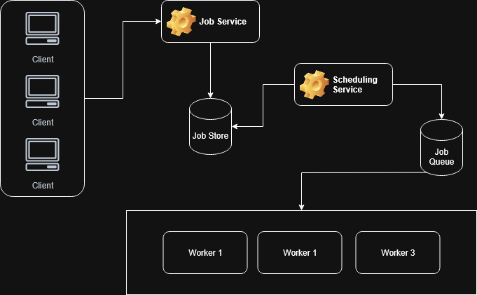

# Distributed Task Scheduler

The goal of this project was to design and develop a distributed task scheduler to manage, schedule, and execute tasks across multiple computers in a distributed network.

## User Stories

- As a user, I can schedule one-time or recurring tasks for execution.
- As a user, I can cancel scheduled tasks.
- As a user, I can monitor the status of my submitted tasks.
